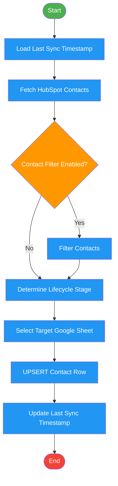

```mermaid
flowchart TD

A([Start]):::startNode
B[Load Last Sync Timestamp]:::processNode
C[Fetch HubSpot Contacts]:::processNode
D{Contact Filter Enabled?}:::decisionNode
E[Filter Contacts]:::processNode
F[Determine Lifecycle Stage]:::processNode
G[Select Target Google Sheet]:::processNode
H[UPSERT Contact Row]:::processNode
I[Update Last Sync Timestamp]:::processNode
J([End]):::endNode

A --> B
B --> C
C --> D
D -->|Yes| E
D -->|No| F
E --> F
F --> G
G --> H
H --> I
I --> J

classDef startNode fill:#4CAF50,color:#fff
classDef endNode fill:#F44336,color:#fff
classDef processNode fill:#2196F3,color:#fff
classDef decisionNode fill:#FF9800,color:#fff
```