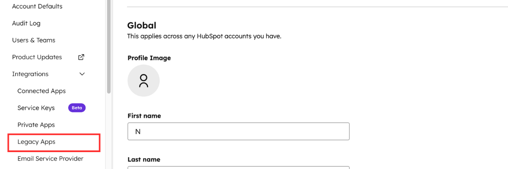
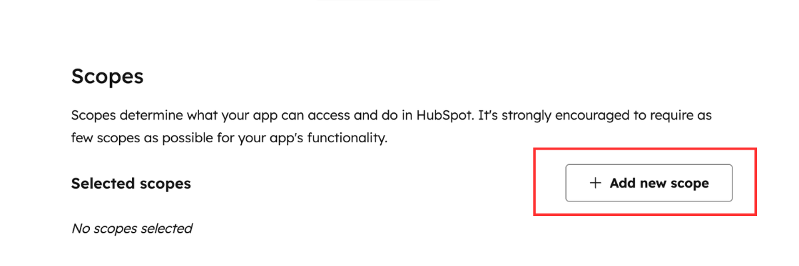
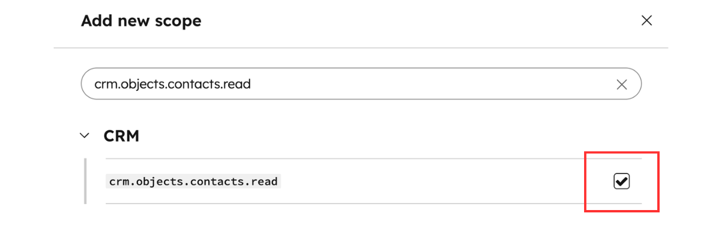
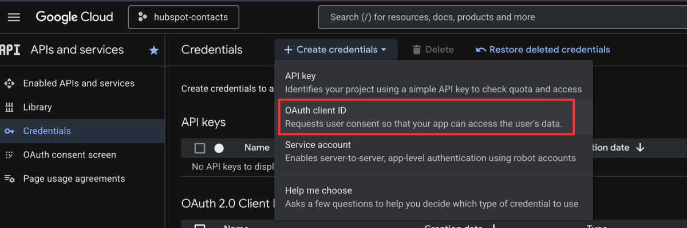
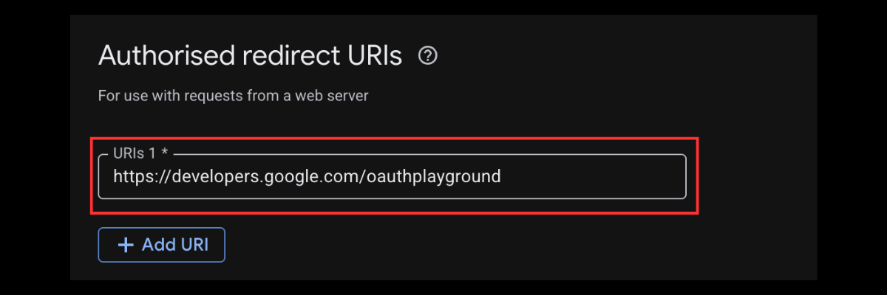
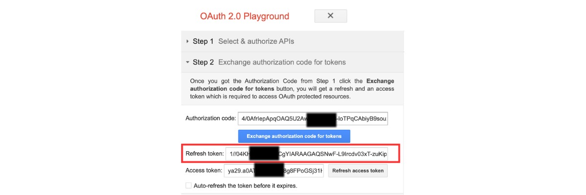

# HubSpot Contacts to Google Sheets

This integration exports HubSpot contacts to a Google Sheet and keeps it synchronized using incremental updates.

## HubSpot Setup

1. Log in to HubSpot.
2. Navigate to **Settings → Integrations → Legacy Apps**. 
3. Create a new private app. 
4. Enable the scope: 
    - crm.objects.contacts.read  
5. Copy the **Access Token**. 

## Google Sheets Setup - Google Cloud Console

1. Create a project in **Google Cloud Console**. 
2. Enable the **Google Sheets API**. 
3. Create **OAuth credentials**. Application type: Web Application  
4. Set the redirect URI to `https://developers.google.com/oauthplayground`. 
5. Save the credentials and copy the Client ID and Client Secret. 

# Refresh Token
1. Go to the [OAuth Playground](https://developers.google.com/oauthplayground).
2. Click the gear icon and check "Use your own OAuth credentials". Enter the Client ID and Client Secret. 
3. Select Scopes →  `https://www.googleapis.com/auth/spreadsheets`. 
4. Click "Authorize APIs" and complete the authorization flow.
5. Click "Exchange authorization code for tokens" to get the Refresh Token. 

## Spreadsheet Setup

1. Create a Google Spreadsheet.
2. Create sheet tabs such as:(if not it will automatically create)
    - `Leads`
    - `Customers`
    - `Default`

3. Copy the **Spreadsheet ID** from the URL.
    Example:
        `https://docs.google.com/spreadsheets/d/1aBcD2EfGhIjKlMnOpQrStUvWxYz1234567890/edit#gid=0`
        id is `1aBcD2EfGhIjKlMnOpQrStUvWxYz1234567890`

## Configuration

Provide the following configuration values when deploying the integration:

- HubSpot access token
- Google OAuth credentials
- Spreadsheet ID
- Sheet names for lifecycle routing
- Field mapping
- Sync schedule interval

## How it works

1. The integration periodically fetches HubSpot contacts.
2. It filters contacts if filtering is enabled.
3. Contacts are routed to sheets based on lifecycle stage.
4. Existing rows are updated using email as the key.
5. Only new or modified contacts are processed using incremental sync.